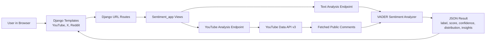

# Sentiment Analysis Web App

A Django-based sentiment analysis project for understanding audience reactions across YouTube, X/Twitter, and Reddit-style text. It fetches public YouTube comments through the YouTube Data API, analyzes pasted X/Twitter and Reddit text, and presents clear sentiment insights using VADER NLP scoring.

## Overview

This app helps users quickly understand whether audience feedback is positive, neutral, or negative. The updated interface focuses on sharper dashboards, animated result states, confidence scores, sentiment distribution, and real insight summaries instead of a single plain label.

## Features

- Fetch and analyze public YouTube comments from a pasted video URL.
- Analyze pasted X/Twitter posts, replies, or thread snippets.
- Analyze pasted Reddit posts, comments, or discussion snippets.
- Classify sentiment as positive, neutral, or negative.
- Show confidence score, average compound score, and sentiment percentages.
- Display key insights and strongest sample comments/text segments.
- Responsive, user-friendly UI for YouTube, X/Twitter, and Reddit pages.
- Clear error handling for invalid URLs, missing API keys, and unavailable comments.

## Tech Stack

- Python
- Django
- NLTK VADER sentiment analyzer
- YouTube Data API v3
- HTML, CSS, JavaScript

## Architecture



## Project Structure

```text
sentiment_Analysis/
├── manage.py
├── requirements.txt
├── Sentiment_app/
│   ├── sentiment_analysis.py
│   ├── urls.py
│   └── views.py
├── sentiment_Analysis/
│   ├── settings.py
│   └── urls.py
└── templates/
    ├── Youtube.html
    ├── twitter.html
    ├── Reddit.html
    └── index.html
```

## Local Setup

1. Clone the repository.

```bash
git clone https://github.com/KunalBadave07/Sentiment_Analysis.git
cd Sentiment_Analysis/sentiment_Analysis
```

2. Create and activate a virtual environment.

```bash
python -m venv .venv
```

On Windows PowerShell:

```powershell
.\.venv\Scripts\Activate.ps1
```

On macOS/Linux:

```bash
source .venv/bin/activate
```

3. Install dependencies.

```bash
python -m pip install -r requirements.txt
```

4. Set your YouTube API key.

On Windows PowerShell:

```powershell
$env:YOUTUBE_API_KEY="your_youtube_api_key_here"
```

On macOS/Linux:

```bash
export YOUTUBE_API_KEY="your_youtube_api_key_here"
```

5. Run the Django app.

```bash
python manage.py runserver
```

6. Open the app.

- Home: http://127.0.0.1:8000/
- YouTube: http://127.0.0.1:8000/Youtube
- X/Twitter: http://127.0.0.1:8000/Twitter
- Reddit: http://127.0.0.1:8000/Reddit

## Pull Latest Changes

Use these commands when you already have the repo locally and want the newest GitHub version:

```bash
cd Sentiment_Analysis
git pull origin main
cd sentiment_Analysis
python -m pip install -r requirements.txt
python manage.py runserver
```

## API Endpoints

| Route | Method | Purpose |
| --- | --- | --- |
| `/Youtube` | GET | Render YouTube analysis UI |
| `/Twitter` | GET | Render X/Twitter text analysis UI |
| `/Reddit` | GET | Render Reddit text analysis UI |
| `/analyze_sentiment/` | POST | Analyze public comments from a YouTube video URL |
| `/analyze_text_sentiment/` | POST | Analyze pasted X/Twitter or Reddit text |

## Notes

- YouTube analysis requires a valid `YOUTUBE_API_KEY`.
- X/Twitter and Reddit pages currently analyze pasted text. They do not fetch live platform comments yet.
- Do not commit API keys or other secrets to GitHub. Keep them in environment variables.
- Generated files such as `__pycache__`, `.pyc`, and logs are ignored by Git.

## Verify

```bash
python manage.py check
```
